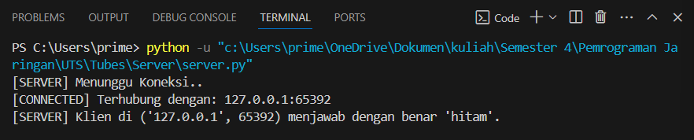
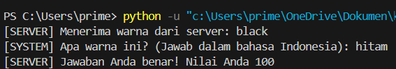
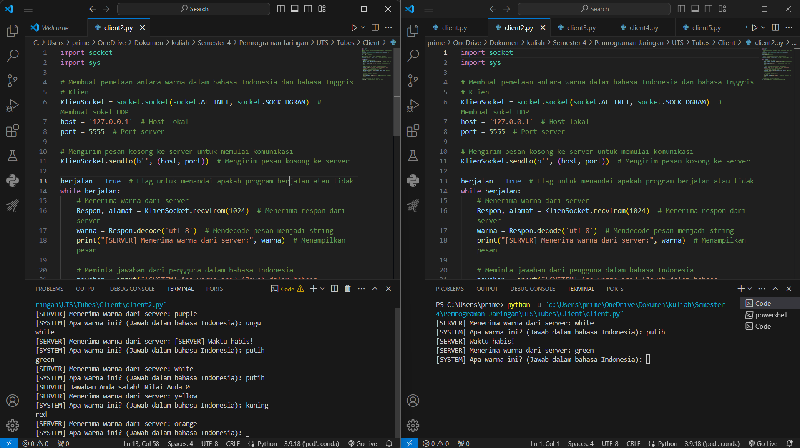

# Permainan Tebak Warna dengan Komunikasi Soket UDP

A brief description of what this project does and who it's for


## 1.How Code Work
A. klien_timer_respons(alamat_klien)

```bash
    def klien_timer_respons(alamat_klien):
    time.sleep(5)  # Klien memiliki 5 detik untuk merespons
    if not respons_diterima.is_set():
        print("[SERVER] Waktu respons telah habis. Tidak ada respons yang diterima.")
        umpan_balik = 0
        kunci_umpan_balik.acquire()
        try:
            umpan_baliks[alamat_klien] = umpan_balik
        finally:
            kunci_umpan_balik.release()
        SocketServer.sendto(b'[SERVER] Waktu habis!', alamat_klien)  # Kirim pesan "Waktu habis" ke klien
```

Fungsi ini mengatur timer untuk respons klien. Jika klien tidak memberikan respons dalam waktu 5 detik, server akan mengirimkan pesan "Waktu habis" ke klien dan memberikan nilai umpan balik 0.

b. hentikan_server()
```bash
  def hentikan_server():
    global berjalan
    berjalan = False  # Set flag berjalan menjadi False untuk menghentikan perulangan while di kode server utama
    utas_pengirim_warna.join()  # Tunggu utas pengirim warna untuk selesai
    SocketServer.close()  # Tutup soket server
    sys.exit(0)  # Keluar dari program dengan kode keluar 0
```

Fungsi ini bertujuan untuk menghentikan server dengan cara menyetel variabel berjalan menjadi False. Ini akan menghentikan perulangan utama pada server. Selain itu, fungsi ini juga menunggu hingga utas pengirim warna (yang mengirimkan warna ke klien secara berkala) selesai, lalu menutup soket server sebelum keluar dari program.

c. kirim_warna_ke_klien(warna)
```bash
 def kirim_warna_ke_klien(warna):
    for alamat_klien in klien:
        SoketKlien.sendto(str.encode(warna), alamat_klien)     
```
Fungsi ini bertujuan untuk mengirimkan warna tertentu ke semua klien yang terhubung. Fungsi ini digunakan oleh utas pengirim warna untuk mengirimkan warna secara berkala ke klien-klien yang terhubung.

d. pengirim_warna(berjalan)
```bash
def pengirim_warna(berjalan):  # Terima flag berjalan sebagai argumen
    while berjalan:
        warna_acak = random.choice(warna)
        kirim_warna_ke_klien(warna_acak)
        time.sleep(10)  # Kirim warna setiap 10 detik
  
```
## 2. OUTPUT


## Screenshots
server


client



## 3. TEST CASE


